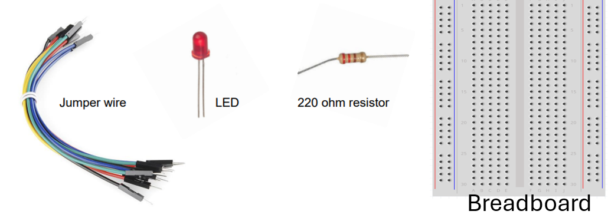
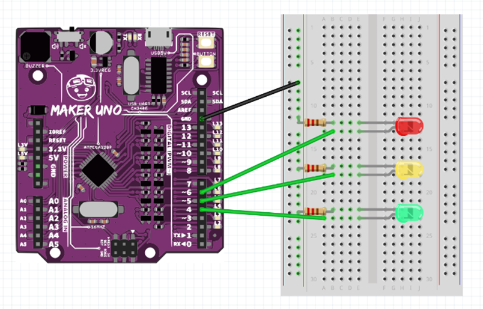
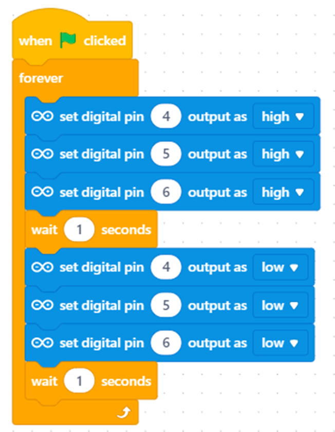
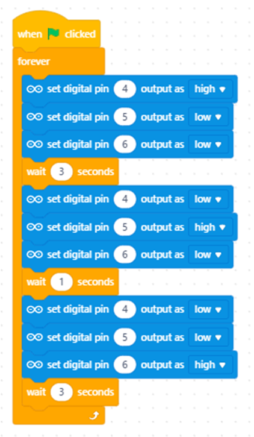

# 🕹️ Splat Game (Jumping + Button)

---

## ⚙️ Step 0 — Switch to Live Mode
Before we begin, make sure your **PictoBlox** is set to **Live Mode**.

---

## 🎬 Starter Activity — LED Basics  
Watch this short video to **refresh your understanding of how LEDs work** and what happens when too much voltage is applied.

<iframe width="100%" height="400"
src="https://www.youtube.com/embed/Yo6JI_bzUzo"
title="LED Basics"
allowfullscreen>
</iframe>

---

## 🧩 Step 1 — Prepare Your Components
Gather the components shown below before you begin wiring your circuit.

---

## 🔌 Step 2 — Build the Circuit
Construct the following circuit on your breadboard.

---

## 💡 Step 3 — Test the LEDs
Use the following code to **test your LEDs**.  
They should turn on and off **in sequence**.

---

## 🚦 Step 4 — Traffic Light Simulation
Now simulate a **traffic light system** using this code.  
Make sure the pin connections are:

- **Pin 4 → Green LED**  
- **Pin 5 → Yellow LED**  
- **Pin 6 → Red LED**

  

---

## 🔁 Step 5 — Running Light (LED Chase)
Create a **Running Light** effect (also known as the *Knight Rider* or *LED Chase*).  
Choose any LED colors you like.

**Concept:**  
LEDs light up one by one from left to right, then back again — repeating continuously.

  

---

✅ *Once you’ve completed all the steps, your LEDs should behave as described in each task.*
