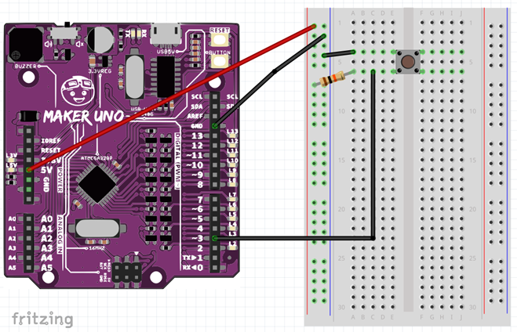
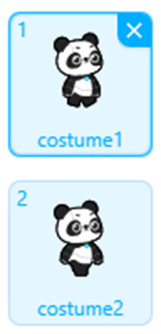
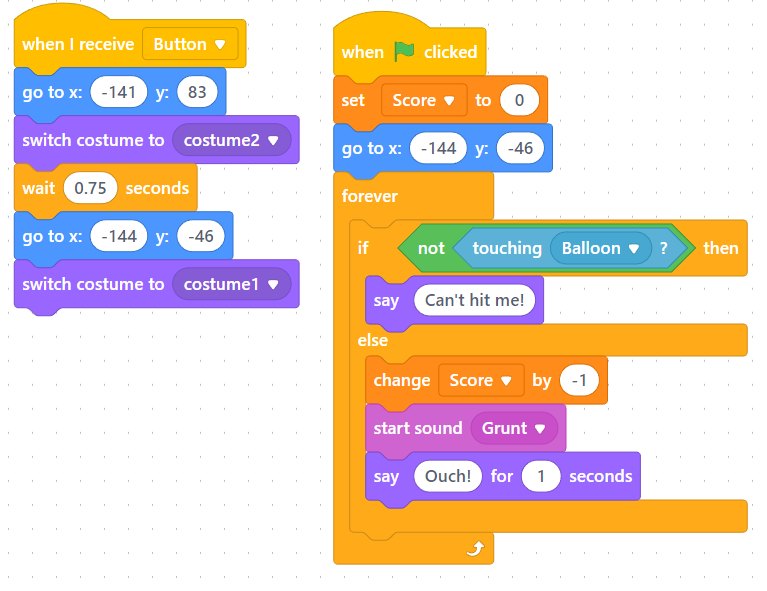
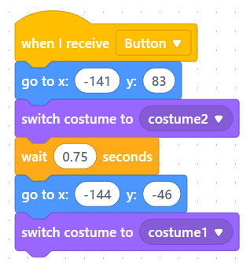
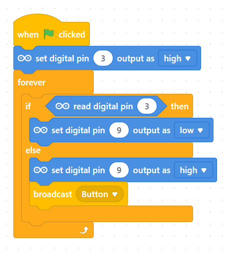

# 🕹️ Splat Game (Jumping + Button)

---

## ⚙️ Step 0 — Switch to Live Mode  
Before we begin, make sure your **PictoBlox** is set to **Live Mode**.

---

## 🧩 Step 1 — Prepare Your Components  
Gather the following components before you start building:

---

## 🔌 Step 2 — Build the Circuit  
Construct your circuit as shown below:

---

## 🧠 Step 3 — Test the Push Button  
Before coding, test your button connection:

1. Press the external push button.  
2. **Observe:**  
    - LED 3 **turns ON** before pressing.  
    - LED 3 **turns OFF** when the button is pressed.  

If this doesn’t happen, check your wiring.  
Still not working? Try this test:

> 💡 **Tip:**  
> Drag the block shown below into your workspace, set **Pin 3** to **output = high**, and **double-click** it to test.

---

## 💾 Step 4 — Download the Template  
[⬇️ Download the Splat Game Template](https://knewtonglobalschools-my.sharepoint.com/:u:/g/personal/michael_gau_knewton_edu_my/EbzNbQWCTaJKlvsOD3legrYBVhQc26w7iyf3qpBHe8fRUw?e=oOhwJh)

Use this template to get started quickly.

---

## 🎨 Step 5 — Customize Your Game  
You can modify the following:

- **Costumes** (e.g. balloons, characters)  
- **Backgrounds** (must include a red border)  
- **Sound Effects**  
- **Code** (optional, as long as it remains a *Splat Game*)

If you can’t download the template, use the code blocks shown below for each sprite.

---

### 🖼️ Background
Any background is fine as long as it includes a **red border**.

---

### 🎈 Balloon Sprite
1. One version should be the **normal balloon** (rotated horizontally).  
2. The other version should be the **popped balloon**.

---

### 🧍 Character Sprite
Use any sprite that can **jump over the projectile**.  
- The **first costume** is the default.  
- The **second costume** is for the **jump animation**.

---

## 🚀 Step 6 — Add Button Control

Now, let’s make your **external button** control the character’s jump.

### 🧩 Sprite Section
1. Create a new message called **“Button”**.  
     

2. Replace the event block:  
   > Change **“When space key pressed”** → **“When I receive [Button]”**  
  

---

### ⚡ Device Section
Add the following code to detect the button press and send the **Button** message.

---

✅ **You’ve completed your Splat Game!**  
Test your button — when pressed, your character should jump!

---

