# Component List

Here are list of components in the physical computing kit.

You may hover your mouse cursor over the ℹ️ symbol to find out more information of the parts.

| Image                                     | Name          |
| ------------------------------------------| ------------------ |
| 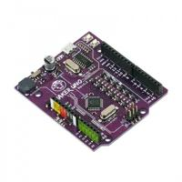   | Microcontroller (Maker Uno) ℹ️ |
| 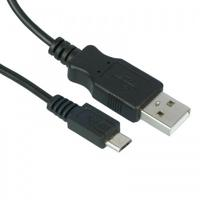   | Micro USB Cable ℹ️|
| 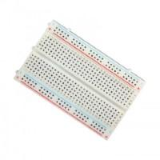| Breadboard ℹ️|
| 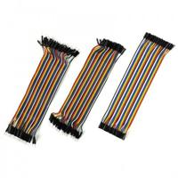| Jumper Cable ℹ️|
|              | Assorted LED ℹ️|
| 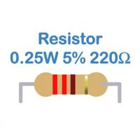| Resistor 220 Ohm ℹ️|
| 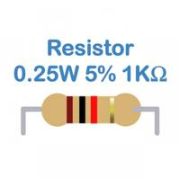| Resistor 1K Ohm ℹ️|
| 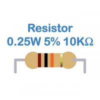| Resistor 10K Ohm ℹ️|
| 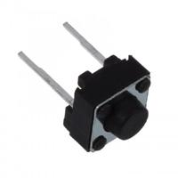| Push Button Switch ℹ️|
| 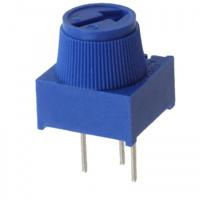| Potentiometer ℹ️|
| 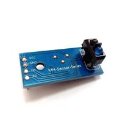| IR Sensor ℹ️|
| 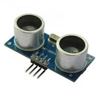| Ultrasonic Sensor ℹ️|
| 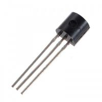| Transistor ℹ️|
| 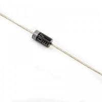         | Diode ℹ️|
| 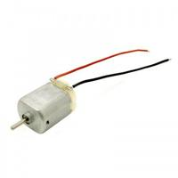         | Motor ℹ️|
| 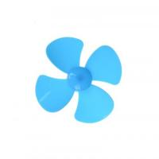| Propeller ℹ️|

Images were acquired from Cytron Technologies

You may buy their kit in this [link](https://my.cytron.io/p-maker-uno-learning-box-everything-you-need-to-start-making).
