# Lesson 0: Setting up hardware and software

Setting up hardware and software

## Task 1 - Connect the microcontroller to the computer

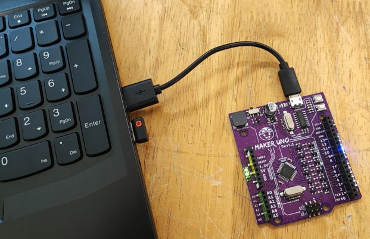

## Task 2 - Download and install the coding environment

If you already have PictoBlox installed, you can skip Task 2 and go to Task 3.

1. Go to [PictoBlox Website](https://thestempedia.com/product/pictoblox/download-pictoblox/ "PictoBlox Website" target="_blank")

2. Choose the suitable version for your operating system.

    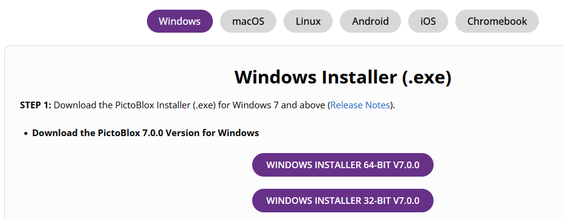

3. Download and install PictoBlox into your computer.

4. Once you installed, launch PictoBlox 5 from the Start Menu 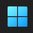 or from your Desktop.

    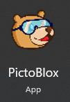

5. In the first screen, select Blocks.

    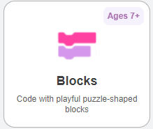

6. Your screen should look something like this.

    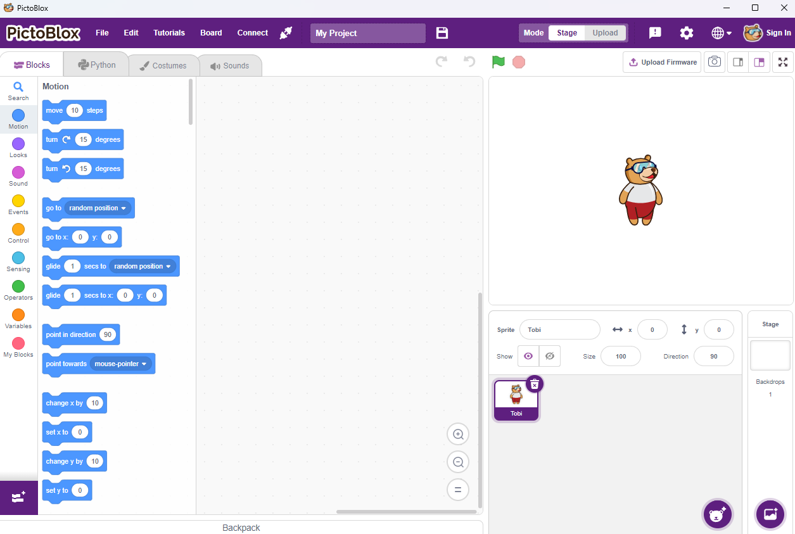

## Task 3 - Setting up your microcontroller (Arduino Uno) with mBlock.

1. First, we have to set the board to Arduino Uno. Click **Board**.

    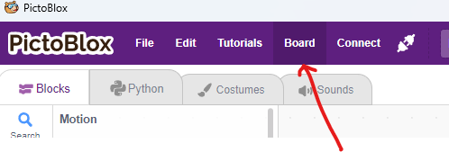

2. Select Arduino Uno.

    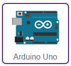

3. You might see a list of devices to connect to. If there's only one, click "Connect".

    If you see multiple options:

    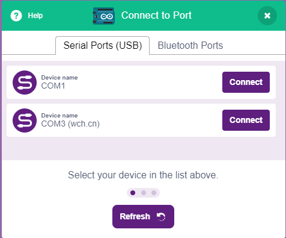 

    Unplug your microcontroller from the computer.

    Click "Refresh" on the connection list. (One device should disappear)

    Reconnect your microcontroller and click "Refresh" again.
    
    Now you should be able to connect to the correct device!

5. You can find the codes for the microcontroller in the new code pallette button named "Arduino Uno".

    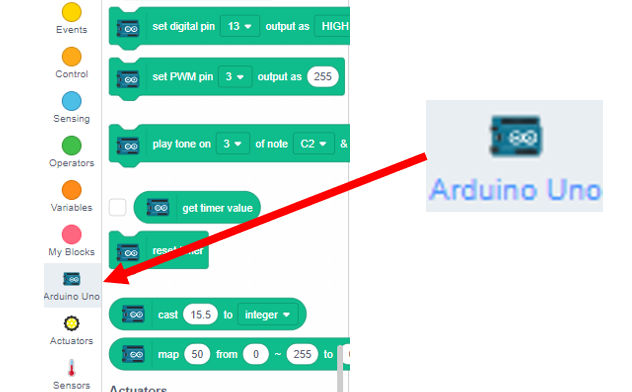

## Task 4 - Switching between Stage and Upload mode

1. In PictoBlox, there are two modes we use: **Stage** mode and **Upload** mode.

    - **Stage**: This is when your code runs right away on the device. 
        
        Remember to "Update Firmware" 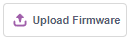 every time you switch to Stage Mode.

    - **Upload**: Your code only runs when you click the 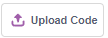  button.

2. You can change the mode through this **Mode Switch** toggle.

    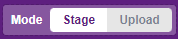

