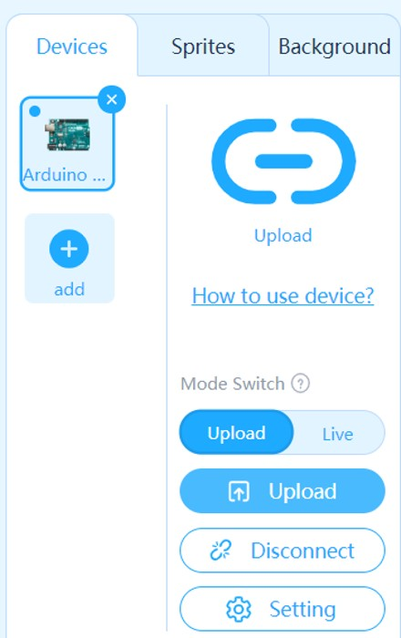

# Lesson 0: Setting up hardware and software

Setting up hardware and software

## Task 1 - Connect the microcontroller to the computer

## Task 2 - Download and install the coding environment

If you already have PictoBlox installed, you can skip Task 2 and go to Task 3.

1. Go to [PictoBlox Website](https://thestempedia.com/product/pictoblox/download-pictoblox/ "PictoBlox Website" target="_blank")

2. Choose the suitable version for your operating system.

    

3. Download and install PictoBlox into your computer.

4. Once you installed, launch PictoBlox 5 from the Start Menu  or from your Desktop.

    

5. In the first screen, select Blocks.

    

6. Your screen should look something like this.

    

## Task 3 - Setting up your microcontroller (Arduino Uno) with mBlock.

1. First, we have to set the board to Arduino Uno. Click **Board**.

    

2. Select Arduino Uno.

    

3. You may see one or more Device COM to connect to. 

    If you only see one Device to connect to, then click it's Connect button.

    But if you see more that one Device to connect to. Then unplug the microcontroller from your computer, and click the Refresh Button. One of the device should dissappear. Then reconnect the microcontroller to the computer and click Refresh again. 

     

    **If you are unsure if that is the Maker Uno, disconnect all USB devices except the Maker Uno.**

5. Your **Devices** section should look like this.

    

## Task 4 - Switching between Live and Upload mode

1. In mBlock, there are two modes we use: **Live** mode and **Upload** mode.

    - **Live**: This is when your code runs right away on the device. 
        
        Remember to "Update Firmware" every time you switch to Live Mode.

    - **Upload**: Your code only runs when you click the   button.

2. You can change the mode through this **Mode Switch** toggle.

    

3. When switching to **Live** coding, you will have to "Update Firmware".
    1. Switch to **Live** mode
    2. Click Update Firmware
    3. Click Updates

    

4. We will often switch between **Live** and **Upload** mode throughout this unit. Remember to "Update Firmware" every time we switch to **Live** mode.

