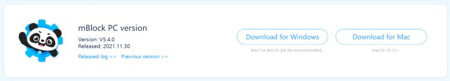
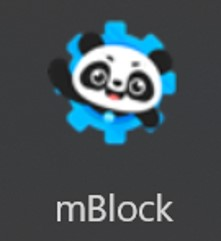
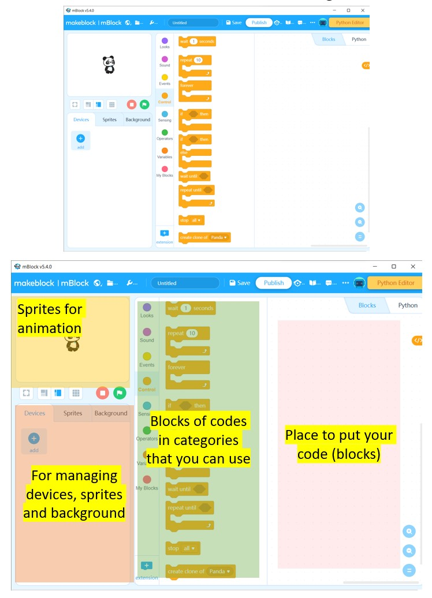
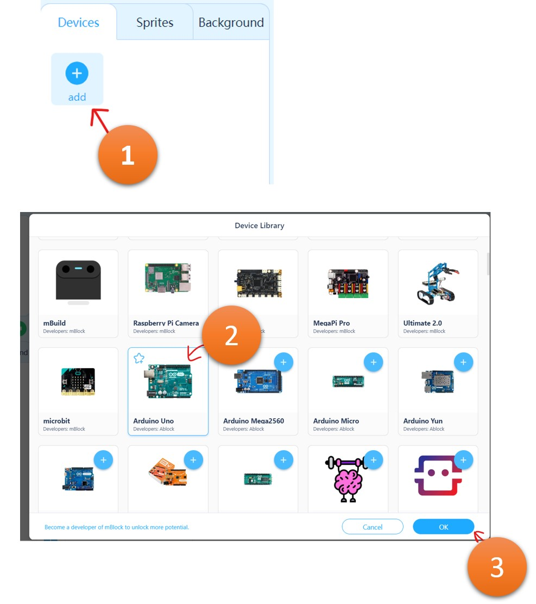
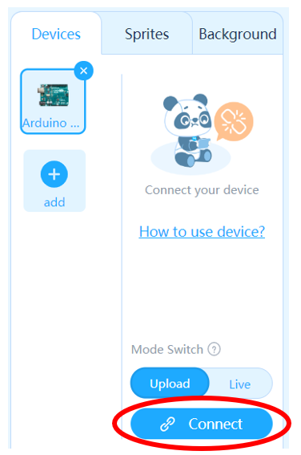
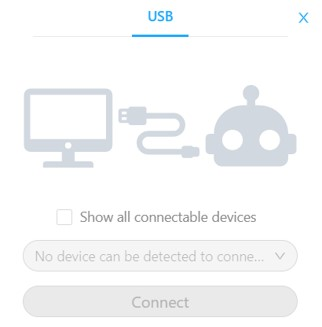
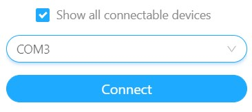
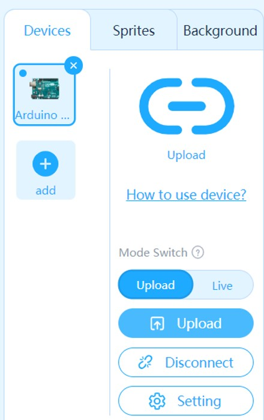
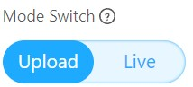
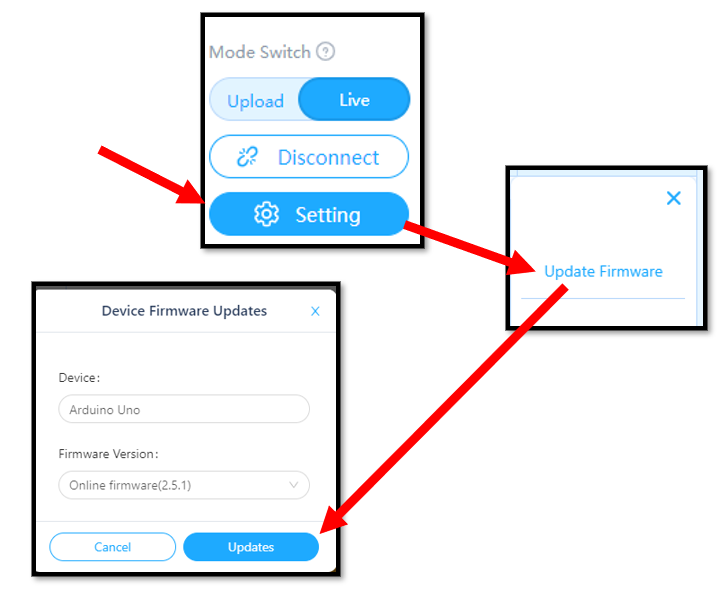

# Lesson 0 - Setting up hardware and software

Setting up hardware and software

## Task 1 - Connect the microcontroller to the computer

## Task 2 - Download and install the coding environment
1. Go to mblock.makeblock.com/en-us/download/

2. Choose the suitable version for your operating system.

    

3. Download and install mBLock 5 into your computer.

4. Once you installed, launch mBlock 5 from the Start Menu or from your Desktop.

    

5. The user interface will look something like this
    

6. Let's add the Arduino UNO into the **device section**.

    

7. Make sure Arduino Uno device is selected in the **devices section**. Then click **Connect**

    

8. You will see this pop-up menu, if it shows "No device can be detected...", then check **Show all connectable devices**.

    
    

9. Select the right COM device and click **Connect**. 

    **If you are unsure if that is the Maker Uno, disconnect all USB devices except the Maker Uno.**

10. Your **Devices** section should look like this.

    

## Task 3 - Switching between Live and Upload mode

1. In mBlock, there are two modes we use: **Live** mode and **Upload** mode.

    - **Live**: This is when your code runs right away on the device. 
        
        Remember to "Update Firmware" every time you switch to Live Mode.

    - **Upload**: Your code only runs when you click the   button.

2. You can change the mode through this **Mode Switch** toggle.

    

3. When switching to **Live** coding, you will have to "Update Firmware".
    1. Switch to **Live** mode
    2. Click Update Firmware
    3. Click Updates

    

4. We will often switch between **Live** and **Upload** mode throughout this unit. Remember to "Update Firmware" every time we switch to **Live** mode.

## End of Lesson 0 Assessment
