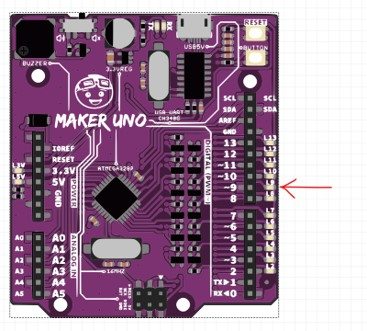
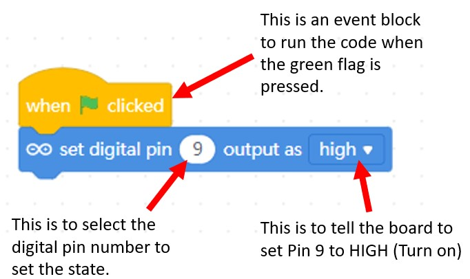
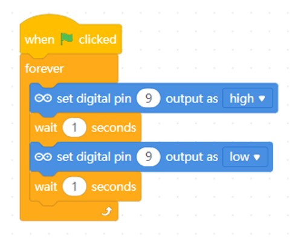

# Lesson 1 - Digital Output

Objectives:

1. To program a single LED to blink.

2. To program multiple LED to blink.

3. To create different LED patterns or sequences.

## Task 1 - Blink an LED

1. Drag and drop the following blocks into your code area.

    

2. Press the green flag  to run the code. 

    
    
    Observe the LED on the microcontroller.

    

    If it does not light up. Make sure your firmware is updated and Live coding is turned on. 

3. How it works?
    

    What do you think would happen if you change the value **high** to **low**
    
4. Now, let's make the LED blink. Modify the previous code to this code.

    

5. Press the green flag  to run the code. 

    
    
    Observe the LED on the microcontroller. The LED at pin 9 should blink every 1 seconds.

Challenge: What can you do so that the LED will blink faster?

## Task 2 - Blinking multiple LED

## Task 3 - LED and Resistors