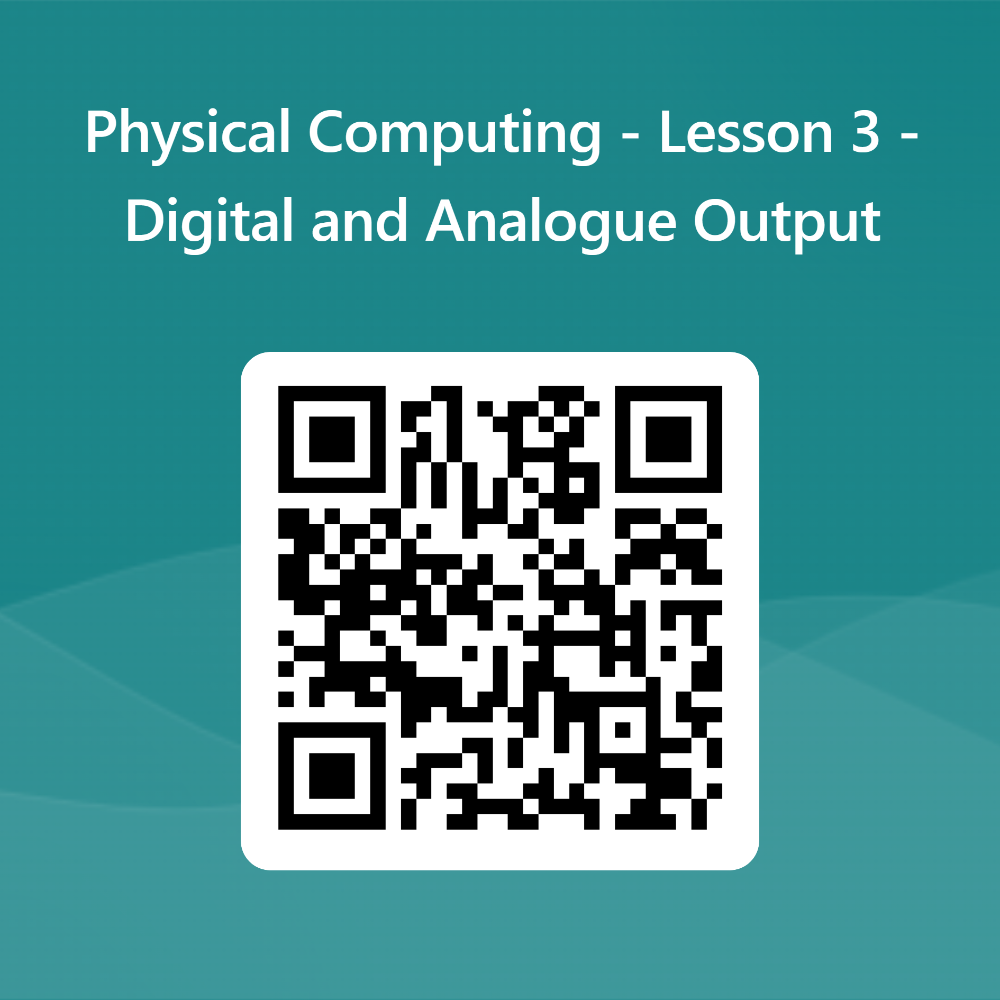

# End of Lesson 3 Quiz

Scan the QR Code below to open the quiz.

Alternatively, you may open the link below and login using your Microsoft account to do the Quiz.

[Link to the Lesson 3 Quiz](https://forms.office.com/r/9EXyB1VFfS)
