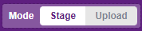

# Project 10: Ultrasonic Sensor

Objective: To program the microcontroller to read value from an ultrasonic sensor to detect distances.

Before we begin, switch to **Stage Mode**

1. Construct the circuit below. You may use a breadboard if you like.
    - VCC  ➡️  5V
    - Trig ➡️  Digital Pin 12
    - Echo ➡️  Digital Pin 11
    - Gnd  ➡️  Gnd

    

    Ultrasonic sensors emit high-frequency sound waves and measure the time it takes for the sound to bounce back from an object. This allows us to calculate the distance between the sensor and the object. In this project, we'll use this concept to create a musical distance detector!

1. Click the board

## Getting the data from the Ultrasonic Sensor.

1. Before getting started, make sure Pictoblox is connected to your microcontroller and your firmware is updated.

1. Create the code below.

1. Then, press . You should be able to see the distance displayed on the Sprite.

    

## Performing a conditional statement

1. Now let's create a variable name *distance*.

    Select .

    Then click .

    Set the new variable name to *distance* and click **OK**.

    

1. Now modify your code to look like this.

    

1. Press the .

    Then use the palm of your hand and place it close to the ultrasonic sensor and far away.

    The sprite should say "too far" when your hand is far away from the sensor and "too close" when your hand is close to the sensor.

## Experiment

1. Try changing the condition to other distances. (distance < 100)
2. Play a sound when your hand is too close to the sensor.
<!-- 

### Reflection
[Click the here to reflect on your project.](https://forms.office.com/r/YR0ZL9FYJe) -->