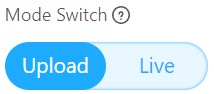
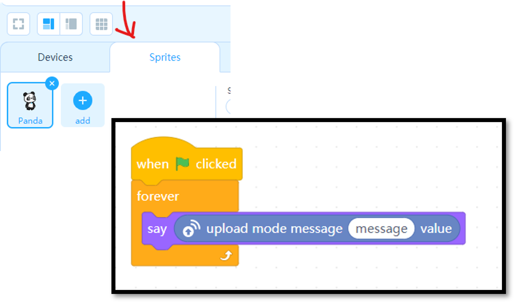

# Project 10: Ultrasonic Sensor

Objective: To program the microcontroller to read value from an ultrasonic sensor to detect distances.

Before we begin, switch to **Upload Mode**

## Installing the Upload Mode Broadcast extension.

1. Construct the circuit below. You may use a breadboard if you like.
    - VCC  ➡️  5V
    - Trig ➡️  Digital Pin 12
    - Echo ➡️  Digital Pin 11
    - Gnd  ➡️  Gnd

    

1. Then, we must install the extension **Upload Mode Broadcast** in mBlock 5 in the **Devices** tab.

    Make sure the devices tab is selected.
    
    

    Then, at the bottom of the screen, click the **extension**  button.

    

1. Search for **Upload Mode Broadcast**. Then look for the extension and click **+ Add**.

    

    Once you added the extensions, you will see a new section from your coding toolbox.

    

1. Next, we will also install the **Upload Mode Broadcast** for the **Sprites** tab.

    Click the **Sprite** tab. 

1. Click the Extensions button .

    Then add the **Upload Mode Broadcast**.

### Remember

The **Devices** and **Sprites** tab each have their own coding workspace.

The code in **Devices** tab will only work in the **Devices** section.
The code in **Sprites** tab will only work in **Sprites** section.

Now we are going to code the microcontroller to:

- *Receive* distance data from the ultrasonic sensor into the microcontroller (Devices tab), and

- *Broadcast* (send) it to the Panda (Sprite tab) to display the distance.

## Getting the data from the Ultrasonic Sensor.

1. Switch to the **Devices** tab and enter the code below.

    

1. Click the  button to upload the code to the microcontroller.

1. Next, switch to the **Sprites** tab and enter the code below.

    

1. Then, press . You should be able to see the distance displayed on the Panda.

    

## Explanation

In mBlock, the **sprite** and **device** sections each have their own coding tools.

The device section connects to the microcontroller and reads the distance data from the ultrasonic sensor.

This distance information is then sent directly to the sprite section.

The panda (which is a sprite) receives the distance message and displays it on the screen using the "say" block.

## Performing a conditional statement

1. Now let's create a variable name *distance*.

    Select .

    Then click .

    Set the new variable name to *distance* and click **OK**.

    

1. Now we will assign a value to the variable.

    Switch to **Sprites** tab.

    Delete the previous code and replace it with this code.

    

1. Press the .

    Then use the palm of your hand and place it close to the ultrasonic sensor and far away.

    The panda should say "too far" when your hand is far away from the sensor and "too close" when your hand is close to the sensor.

