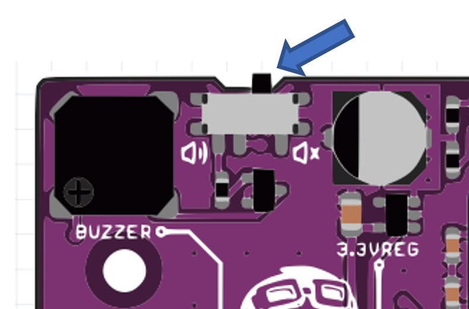
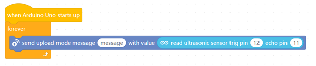
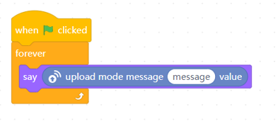
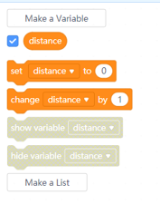
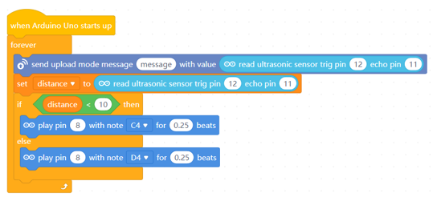
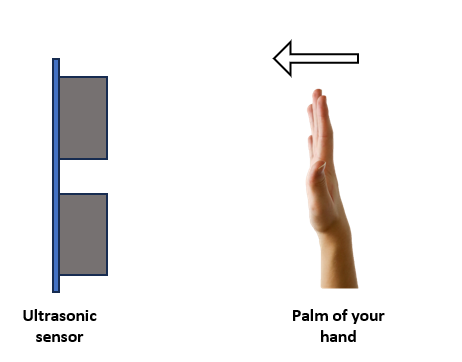
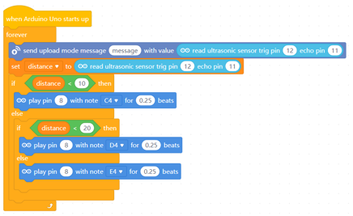
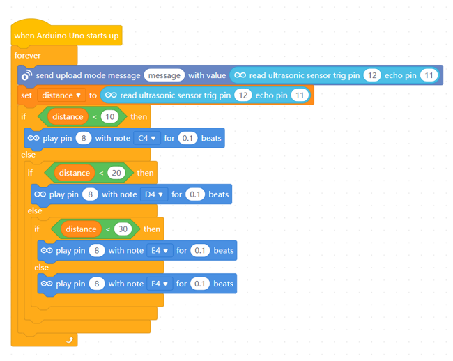

# Project 11: Musical Air Instruments

Objective: To program the microcontroller to read value from an ultrasonic sensor to detect distances and play different sound based on the distance.

Before we begin, switch to **Upload Mode**

You may use the same circuit and code from the previous project.

1. Make sure to double-check your wiring before you begin.
    - VCC  ➡️  5V
    - Trig ➡️  Digital Pin 12
    - Echo ➡️  Digital Pin 11
    - Gnd  ➡️  Gnd

    

1. Make sure the buzzer is turned on.

    

1. Similar to the previous project, write the following code in their respective section.

    **Devices** section
    

    **Sprites** section
    

    We use this same code so that we can look at the distance as a reference.

1. Switch to the **Devices** section.

    Create a variable named "distance". If you already have this variable from the previous project, you can reuse that instead.

    

1. Then modify your code to look like this.

    

    Click the  button.

    Try to move the palm of your hand close to the ultrasonic sensor and far from it. 
    
    
    Does your microcontroller play different notes?

    If not, check your code or wiring.

1. Now we will add more notes. Modify your code to this.

    

    Click the  button.

    The buzzer of the microcontroller should play three different notes when you move the palm of your hands towards and away from the ultrasonic sensor.
    

1. Now let's make the buzzer play 4 different notes. Modify your cdoe to look like this.

    

    Your microcontroller should now be able to play 4 different notes as you move your palm towards and away from the ultrasonic sensor.

## Challenges
Add more Air Musical Notes. Have at least 5 notes. You can try to adjust the distance for each notes. Instead of the distance of by 10, try by 5. You may also adjust the beats to 0.1 beats to have more faster beats!

