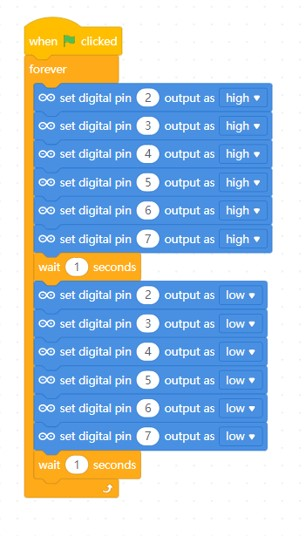
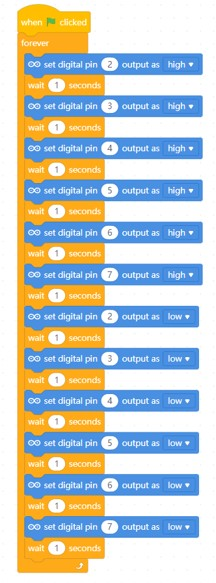

# Project 2 - Blinking the LEDs in sequences

Objective: To program multiple LED to blink.

Before we begin, switch to **Live mode**

1. In this project, we will blink LED 2 to LED 7 in sequence.

2. Modify the previous code to the following:
    
    

3. Press the green flag  and observe the result.

4. Did LED 2 to LED 7 blink? If so, you can continue to the next step.

5. Modify your code into this sequence.

    

6. Press the green flag  and observe the result.

### Challenge 
Try coding an LED sequence so that one LED will blink one at a time.

***Once completed, inform your teacher to check your progress.***

### Reflection
[Click the here to reflect on your project.](https://forms.office.com/r/YR0ZL9FYJe)