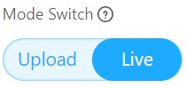
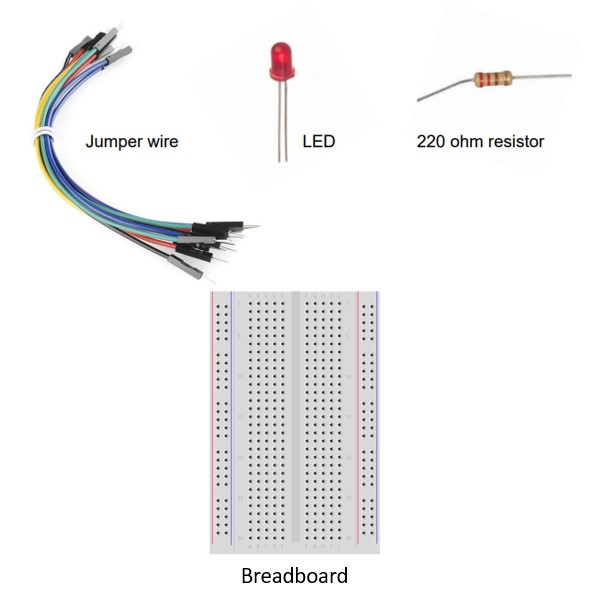
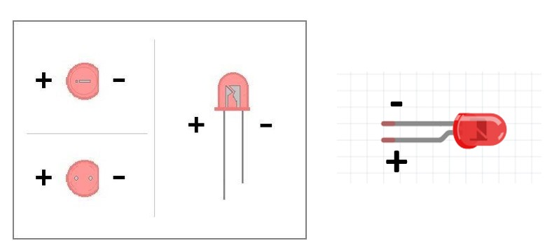
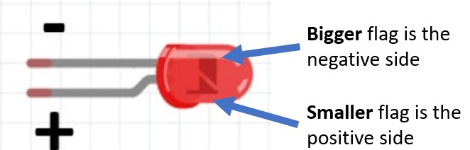
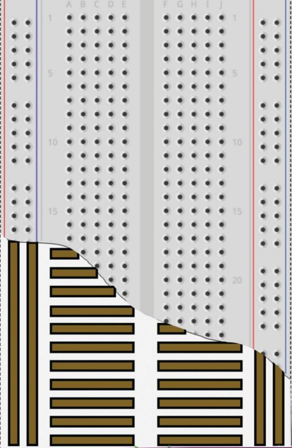
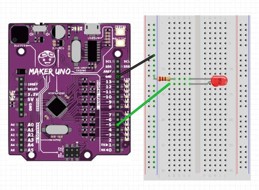
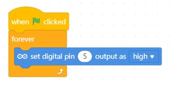
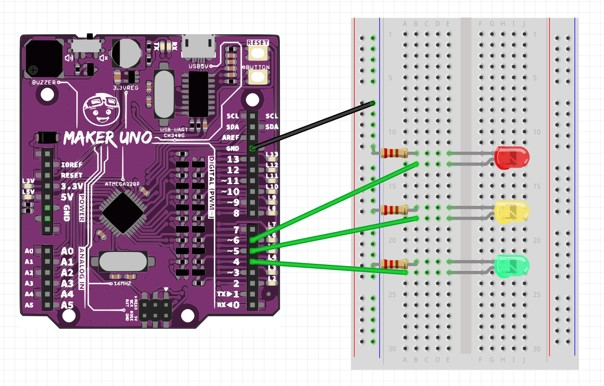

# Project 3 - LED and Resistors

Objective: To build a circuit using LEDs and Resistors.

Before we begin, switch to **Live mode**

In this project, you will need these components.

** **IMPORTANT** **:
Any circuit involving an external LED, a resistor at least 220 ohms is required.

## What is an LED (Light Emitting Diode)

LED is short for Light-Emitting Diode.

A diode is an electrical component which controls the flow of electrical current, in this case, the electric current can only flow one way. 

To check the polarity of the LED, observe the pin of the LED.

- Shorter pin (-) Negative terminal or ground pin (GND).
- Longer pin (+) Positive terminal or the Digital Pin.

Alternatively, you could look in the led head, the one with the “bigger flag” is the negative side.

   
## What is a Breadboard
The breadboard contains conductive material underneath the pinholes. 

   

## Building the circuit and code

1. After understanding the LED and breadboard, let's get started. Construct the circuit below.

2. Write the following code.

3. Press the Green flag  button and observe the results. Did the LED light up? If it does not light up, check the polarity of the LED.

 
 
 
### Challenge: Now try adding two more sets of LEDs and Resistors to your board.

Modify your code so that all three LED will light up in sequences.