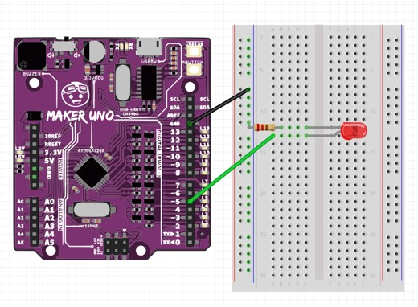

# Project 4: Fade An LED

Objective: To program an analogue output by fading the LED light.

Before we begin, switch to **Live mode**

1. You will need the following components:

    

2. Then construct the following circuit:

    

3. Write the following code.

    

4. Press the Green flag  button and observe the results.   **The LED should gradually brighten every second, as the code functions by incrementally increasing the intensity of the LED light.**
   
## Difference between analogue and digital output

- Digital Output has two outcomes, HIGH or LOW.
    - Example: Think of turning a light switch on or off, 
- Analogue Output is continuous with values ranging from 0 to 255
    - Example: adjusting a volume knob smoothly instead of just turning it on or off.

The diagram below shows how analogue and digital signal works.

### Challenge 

Modify the code so that, the LED brightness will fade dimmer instead.

Could you try to make the LED fade more smoothly?

***Once completed, inform your teacher to check your progress.***