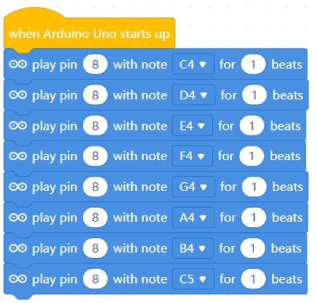
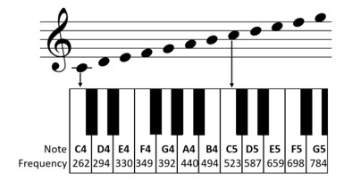
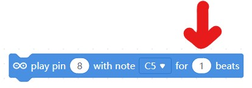
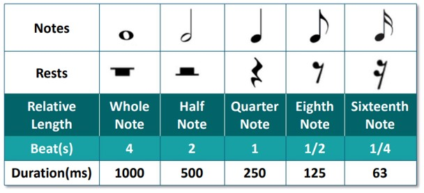

# Project 6: Compose Basic Tone

Objective: To program the microcontroller to compose a basic tone.

Before we begin, switch to **Upload Mode**

Check the switch at the **top-left** of the microcontroller and make sure it is pushed to the left.

*This is to enable the buzzer at pin 8*

1. Write the following code and then press .

    

2. Does the microcontroller make any sounds? If not, make sure to check if you have flipped the switch to turn on the buzzer.

3. The buzzer on the microcontroller is playing hte basic tone "Do Re Mi Fa So La Ti Do". The diagram below shows the notes that are being played.

    

4. Different musical notations are used to tell the duration of the note to be played. You can set the duration to be played by changing the value for the beat.

    

5. Here is a table that shows the connection of the notes to the amount of beats. You will use this as a reference for the next project.

    

6. For the beats in fraction:
    - 1/2  is equal to 0.5 beats
    - 1/4 is equal to 0.25 beats

### Challenge

Try increasing the speed of the song by changing the duration(beats) of each notes.

***Once completed, inform your teacher to check your progress.***

### Reflection
[Click the here to reflect on your project.](https://forms.office.com/r/YR0ZL9FYJe)