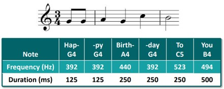
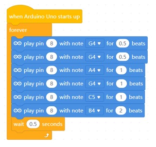

# Project 7: Compose Melody

Objective: To program the microcontroller to compose a melody.

Before we begin, switch to **Upload Mode**

1. You are going to compose the "Happy Birthday" melody. Here below is the musical notes.

    

2. Write the following code and try to understand the relation between this code and the musical notes above.

    

3. Now try make the melody of "Twinkle Twinkle Little Stars". Here are the notes for your reference.

    - C4,C4,G4,G4,A4,A4,G4
    - F4,F4,E4,E4,D4,D4,C4 

    All of the notes will be 0.25 beat except for the last note which is 1 beat.

### Challenge
Come up with your own melody, or try finding a melody online. You may use this search term.
"Music notes for (music name)".

Example: "Music notes for Mario Theme"

***Once completed, inform your teacher to check your progress.***

### Reflection
[Click the here to reflect on your project.](https://forms.office.com/r/YR0ZL9FYJe)