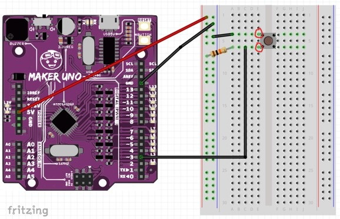

# Project 7: Button

Objective: To program a button to perform an action.

Before we begin, switch to **Live mode**

1. Prepare these components

    

2. Construct the circuit as shown below.

    

3. After constructing the circuit, we will have to test if the button is working. 

4. Press the external push button switch and observe if LED 3 turns on.

    

5. If it is still does not work, try setting digital pin 3 to HIGH by placing this code on your workspace and double-clicking it. 

    

6. If it is not working, please check your circuit.
7. Once it works, type in the following code.

    

8. Execute the code and observe the results. Does the LED on Pin 8 lights up when you press the button? If so, then you may proceed to the challenge.

### Challenge
Create a circuit and program where when you press the button, **three different LED will light up.**

***Once completed, inform your teacher to check your progress.***

### Reflection
[Click the here to reflect on your project.](https://forms.office.com/r/YR0ZL9FYJe)