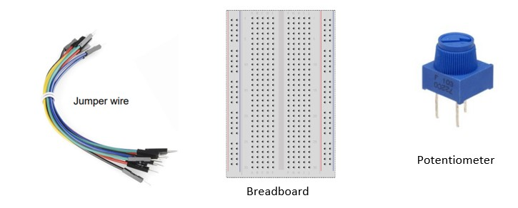
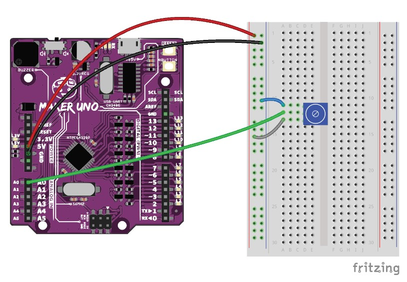
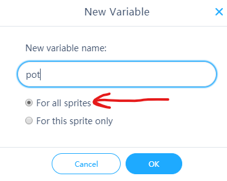
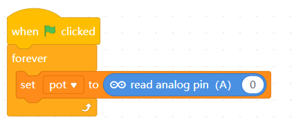
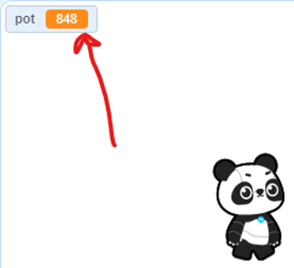
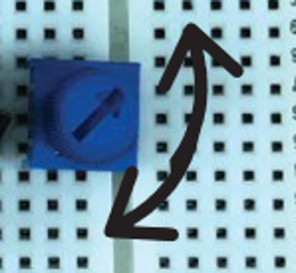
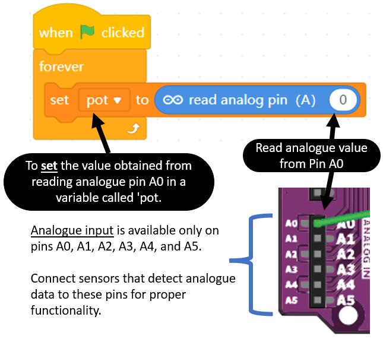
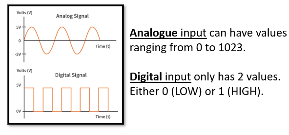

# Project 8: Potentiometer

Objective: To program the microcontroller to read analogue data from a potentiometer

Before we begin, switch to **Live Mode**

1. Prepare the following components:

    

2. Construct the following circuit:

    

3. In the coding toolbox, click .

4. Then click .

5. Enter the new variable name "pot", ensure the option "For all sprites" is selected.

    
    
    *By selecting “for all sprites” the value of this variable will be accessible in the sprite section. However, this only works on ***Live Mode***. In ***Upload mode***, you must use ***Upload Mode Broadcast extension***.*"

6. Then write this code.

    

7. Press the  to execute the code.

8. Observe the value of the **pot** variable at the top left of the sprite screen.

    

9. Try turning the potentiometer clockwise and counter-clockwise.

    

10. The value in the pot variable should change when you turn the potentiometer.

11. Can you find out what is the **highest** and **lowest** number that you can get when turning the potentiometer?

## Explanation

### Reflection
[Click the here to reflect on your project.](https://forms.office.com/r/YR0ZL9FYJe)