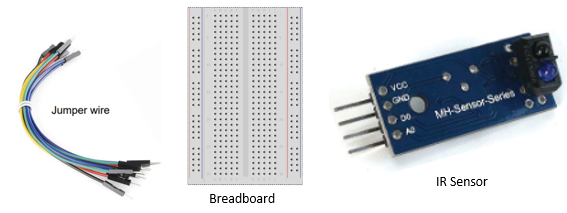
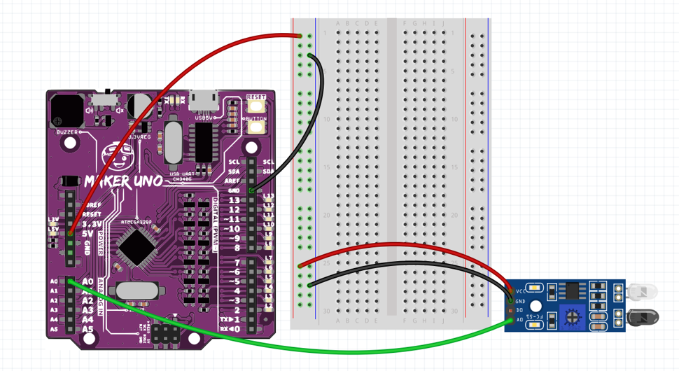
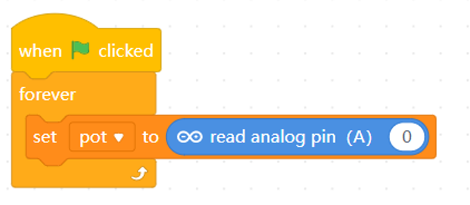
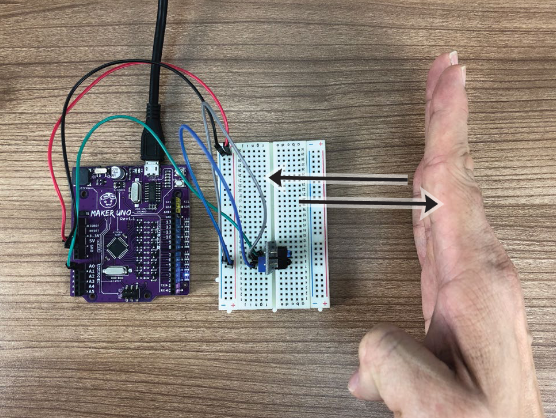
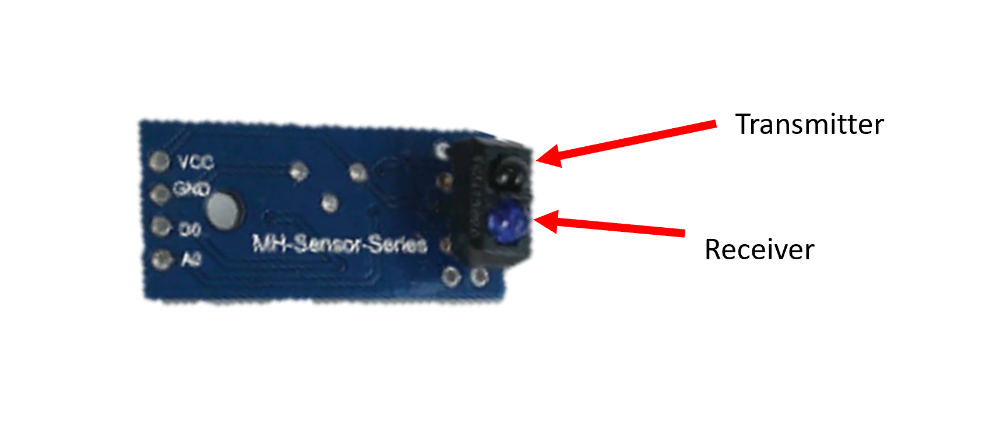
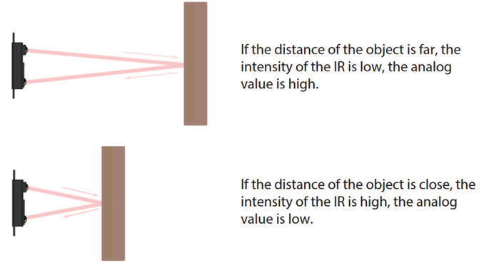

# Project 9: IR Sensor

Objective: To program the microcontroller to read analogue input from an Infrared Sensor (IR Sensor).

Before we begin, switch to **Live Mode**

1. Prepare the following components:

    

2. Construct the following circuit:
    - VCC ➡️ 5V
    - GND ➡️ GND
    - A0 ➡️ A0

    

3. You may reuse the code from the previous project. If not, you may recreate a variable with any suitable name (e.g. **pot**).

    

4. Press the  to execute the code.

5. Observe the value of the variable while trying to move the palm of your hand closer and away from the sensor.

    

## Explanation

An Infrared (IR) sensor has two parts: the **transmitter** and a **receiver**.

When you turn it on, the transmitter sends out infrared light.

If something is in front of the sensor, the light bounces back to the receiver.

The distance between the object and the sensor affects how much light the receiver gets.

This amount of light is turned into a number that you can see in the variable. 

When there is a lot of light reflected, the number is small.

### Reflection
[Click the here to reflect on your project.](https://forms.office.com/r/YR0ZL9FYJe)